# 🖼️ C Image Manipulation & IUP GUI Tool

A lightweight, high-performance image manipulation program written in pure C. This project features a custom, from-scratch 24-bit uncompressed BMP reader/writer, memory-safe pixel operations, and a desktop user interface built using the IUP GUI toolkit.

---

## 🚀 Features

* **Custom BMP Reader & Writer:**
  * Reads and writes uncompressed 24-bit (`BI_RGB`) BMP files without using external image processing libraries.
  * Correctly handles scanline alignment (4-byte row padding).
  * Automatically normalizes top-down (negative height) and bottom-up (positive height) BMP orientation conventions.
* **Core Image Processing Engine:**
  * Dynamic memory management using a contiguous 1D pixel buffer.
  * Built-in bounds and integer-overflow protections for safe memory allocations.
  * Modular design (`operations.c`) for extending image filters and transformations.
* **Graphical User Interface (IUP):**
  * Native desktop interface built with the IUP GUI toolkit.
  * Load, manipulate, and save BMP images interactively.

---

## 💻 Getting Started

### Prerequisites
Make sure you have a C compiler (GCC/MinGW or MSVC) and the **IUP GUI toolkit** configured on your system.

* **GCC / MinGW** (for Windows/Linux)
* **IUP Library** (headers and binary distribution included in `/include` and `/iup`)

---

## 🛠️ How to Build and Run

1. **Clone the Repository:**
   ```bash
   git clone [https://github.com/FyeizaYusraYusha/imagemanipulation_software.git](https://github.com/FyeizaYusraYusha/imagemanipulation_software.git)
   cd imagemanipulation_software

---


### 1. Compile the Software
Using GCC (adjust include/library paths if necessary):

```cmd
gcc main.c gui.c image.c bmp.c operations.c -o imagemanipulation.exe -Iinclude -Liup -liup -lIupControls
```

### 2. Run the Application

```cmd
./imagemanipulation.exe
```

---

## 🕹️ Operations & Usage Guide

1. **Load an Image:** Click on **File > Open** (or use the menu bar) to load a standard 24-bit `.bmp` file (e.g., `lena.bmp`).
2. **Apply Adjustments:**
   * **Grayscale / Invert:** Converts pixel color spaces or flips pixel values.
   * **Brightness:** Adjusts overall image luminance up or down.
   * **Filters:** Select **Blur** or **Sharpen** from the **ADJUSTMENTS** menu to apply spatial convolution matrix operations.
3. **Transformations:**
   * **Flip / Rotate:** Use the **TRANSFORM** menu to mirror horizontally/vertically or perform 90° matrix rotations.
   * **Crop:** Drag a selection rectangle across the canvas and click **Crop** to isolate the pixel region.
   * **Undo:** Revert your most recent modification.
  
---

### Application Interface

| Main GUI Window |
| :---: |
| 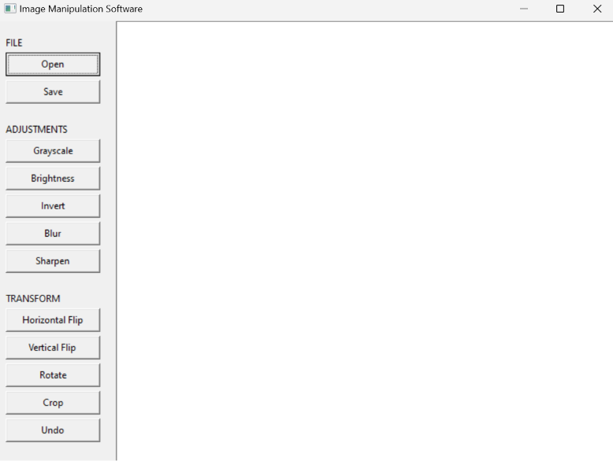 |

---

### File Operations (FILE)

| Image Loaded |
| :---: |
| 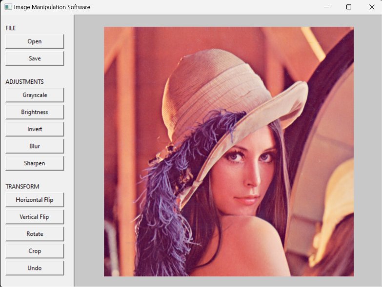 |

---

### Basic Image Adjustments (ADJUSTMENTS)

| Grayscale | Color Inversion |
| :---: | :---: |
| 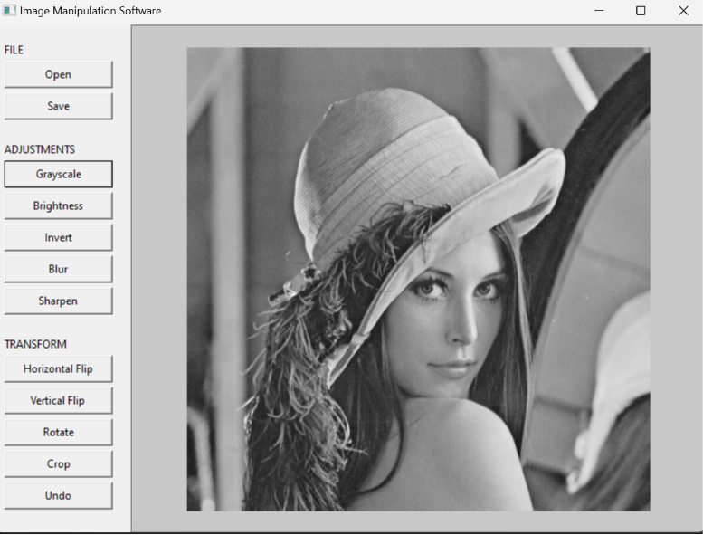 | 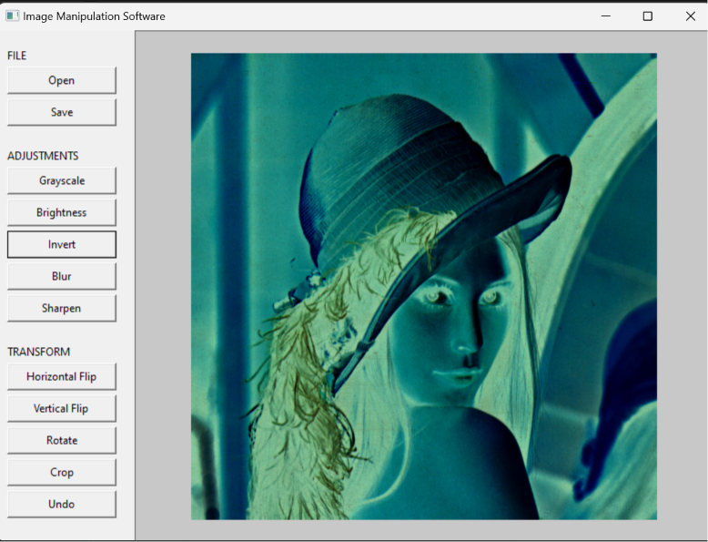 |

| Brightness (UI) | Brightness (Increased) |
| :---: | :---: |
| 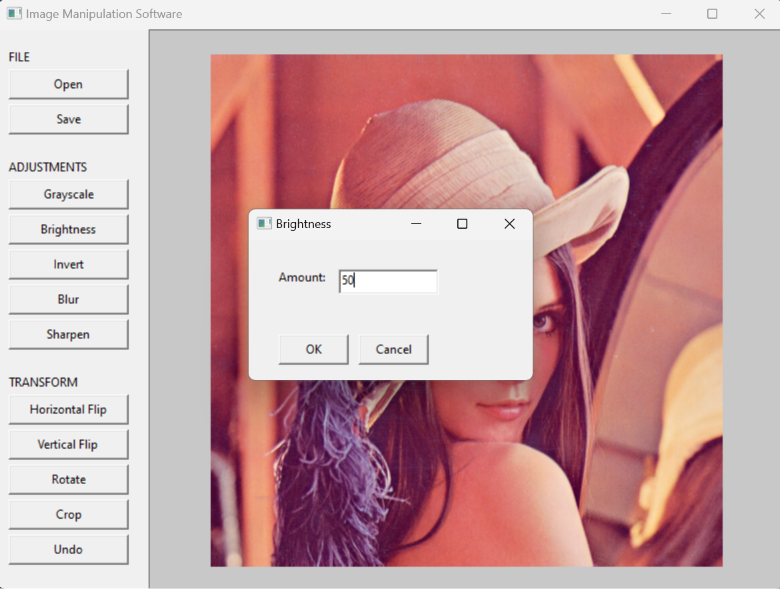 | 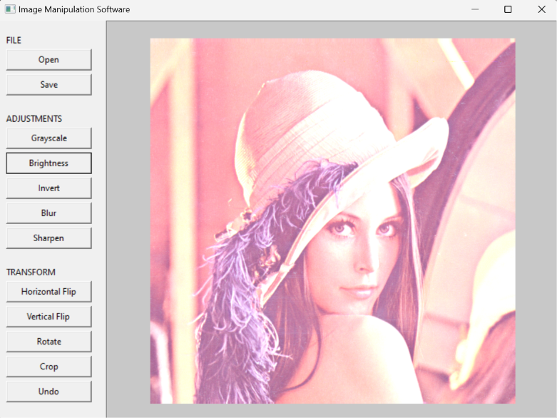 |

| Blur Filter | Sharpen Filter |
| :---: | :---: |
| 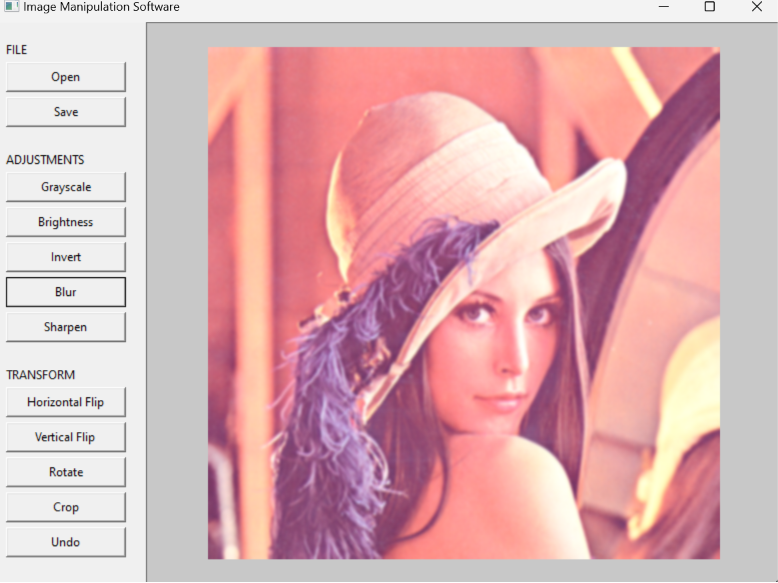 | 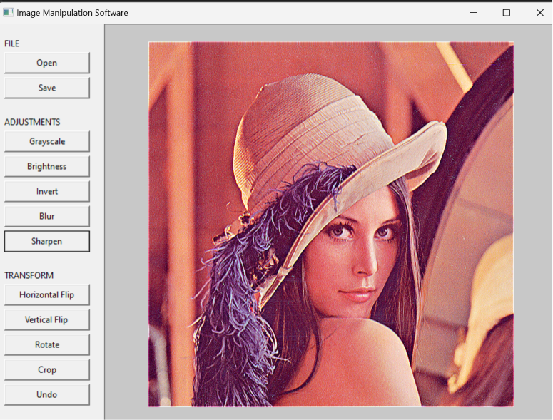 |

---

### Transformations & Editing (TRANSFORM)

| Horizontal Flip | Vertical Flip |
| :---: | :---: |
| 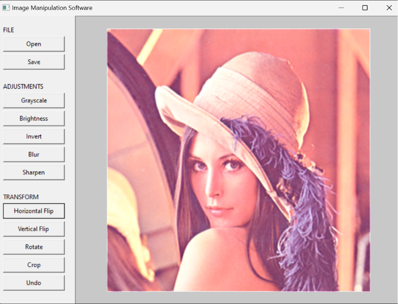 | 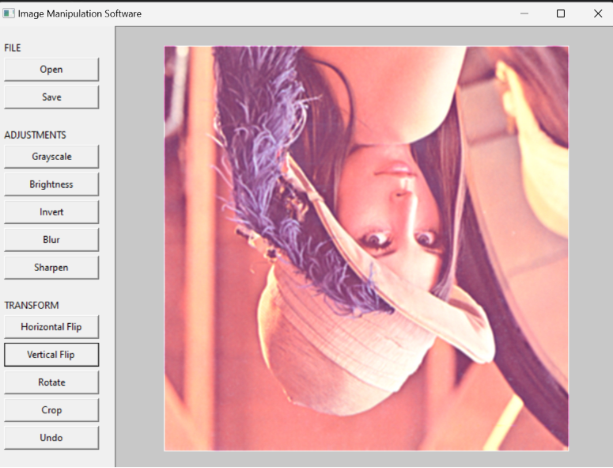 |

| Image Rotation | History & Undo |
| :---: | :---: |
| 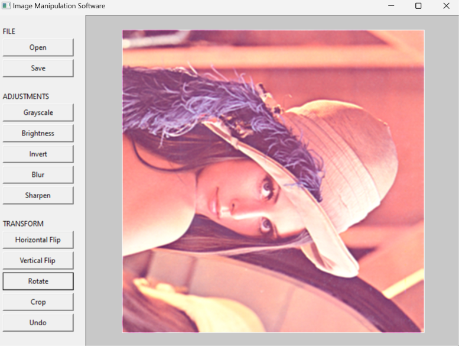 | 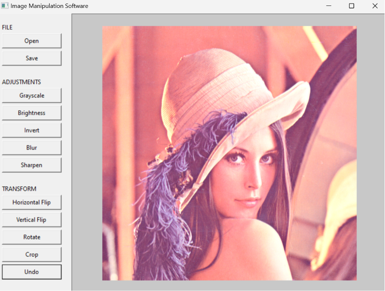 |

| Crop Selection | Cropped Output |
| :---: | :---: |
| 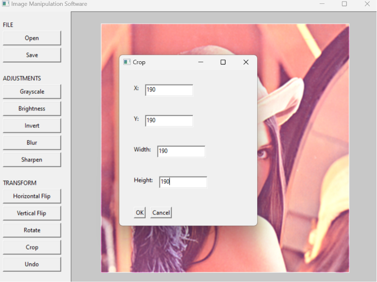 | 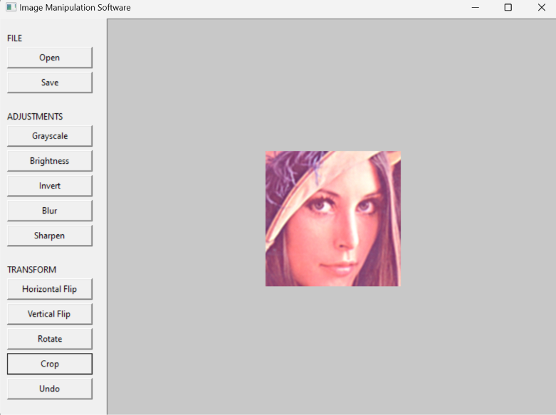 |
